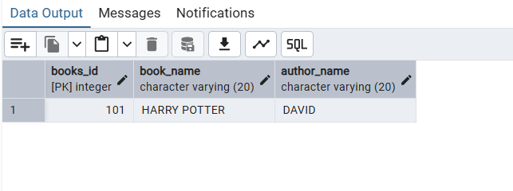
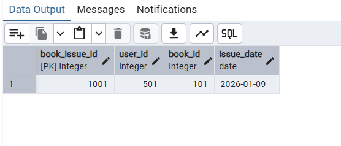
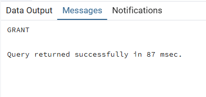

# Experiment 1: Database Creation with Constraints, Relationships & User Access Control

## 1. Aim of the Session

The purpose of this practical is to provide hands-on experience in designing and implementing a comprehensive database system for a library management scenario. Students will learn to create tables with various constraints, establish relationships between tables, and manage user access through roles and permissions in a Database Management System (DBMS).

Purpose of the practical:
- To understand how to create databases and tables with proper structure
- To implement data integrity through constraints and relationships
- To manage user access and permissions in a DBMS

---

## 2. Objective of the Session

The specific goals of this session are:

- **Learn Table Creation**: Understand how to create tables with various data types and constraints
- **Implement Data Integrity**: Apply PRIMARY KEY, FOREIGN KEY, NOT NULL, UNIQUE, and CHECK constraints to ensure data quality
- **Establish Relationships**: Create relationships between multiple tables using foreign keys (one-to-many relationships)
- **Manage Roles & Permissions**: Create user roles and grant/revoke database permissions
- **Data Manipulation**: Insert, retrieve, and manage data using SQL queries
- **Database Security**: Understand role-based access control and permission management

Upon completion, students will be able to:
- Design normalized database schemas with proper relationships
- Implement constraints to maintain data integrity
- Manage user access and database security
- Write SQL DDL (Data Definition Language) statements confidently

---

## 3. Practical / Experiment Steps

The experiment involves creating a Library Management System database with the following components:

### Step 1: Create the BOOKS Table
- Define a table to store book information
- Implement PRIMARY KEY constraint on BOOKS_ID
- Use VARCHAR for text fields and NOT NULL constraint for mandatory fields

### Step 2: Create the LIBRARY_VISITORS Table
- Define a table for library members
- Implement PRIMARY KEY on USER_ID
- Apply CHECK constraint to ensure visitors are at least 17 years old
- Apply UNIQUE constraint on EMAIL to prevent duplicate email registrations
- Use NOT NULL constraints for mandatory fields

### Step 3: Create the BOOK_ISSUE Table
- Define a table to track which books are issued to which visitors
- Implement PRIMARY KEY on BOOK_ISSUE_ID
- Use FOREIGN KEY constraints to establish relationships with BOOKS and LIBRARY_VISITORS tables

### Step 4: Insert Sample Data
- Insert book records into the BOOKS table
- Insert visitor records into the LIBRARY_VISITORS table with valid data
- Insert book issue records linking books to visitors

### Step 5: Create Database Roles and Manage Permissions
- Create a LIBRARIAN role with login credentials
- Grant permissions (SELECT, INSERT, UPDATE, DELETE) on specific tables
- Revoke permissions to demonstrate access control

---

## 4. Procedure of the Practical

Follow these sequential steps to execute the experiment:

### (i) Start the System and Open Database Management System
- Power on the computer and log in
- Open the Database Management System (SQL Server / MySQL / Oracle)
- Ensure you have administrative access to create databases and roles

### (ii) Create or Select the Required Database
- Create a new database or select an existing one for the library management system
- Verify the database is active before proceeding

### (iii) Drop Existing Tables (Optional)
- Execute `DROP TABLE IF EXISTS BOOKS` to remove any existing tables and start fresh
- This ensures a clean state for the experiment

### (iv) Create the BOOKS Table
```sql
CREATE TABLE BOOKS(
    BOOKS_ID INT PRIMARY KEY,
    BOOK_NAME VARCHAR(20) NOT NULL,
    AUTHOR_NAME VARCHAR(20) NOT NULL
)
```
- Execute the command to create the table
- Verify successful creation

### (v) Create the LIBRARY_VISITORS Table
```sql
CREATE TABLE LIBRARY_VISITORS(
    USER_ID INT PRIMARY KEY,
    NAME VARCHAR(20) NOT NULL,
    AGE INT CHECK(AGE>=17) NOT NULL,
    EMAIL VARCHAR(20) NOT NULL UNIQUE
)
```
- Execute the command with constraints
- Note the CHECK constraint for age validation

### (vi) Create the BOOK_ISSUE Table with Foreign Keys
```sql
CREATE TABLE BOOK_ISSUE(
    BOOK_ISSUE_ID INT PRIMARY KEY,
    USER_ID INT REFERENCES LIBRARY_VISITORS(USER_ID),
    BOOK_ID INT NOT NULL,
    FOREIGN KEY(BOOK_ID) REFERENCES BOOKS(BOOKS_ID)
)
```
- Execute to establish relationships between tables
- Verify foreign key constraints are properly set

### (vii) Insert Data into BOOKS Table
```sql
INSERT INTO BOOKS VALUES(101, 'HARRY POTTER', 'DAVID')
```
- Execute to insert book records
- Verify insertion using SELECT query

### (viii) Insert Data into LIBRARY_VISITORS Table
```sql
INSERT INTO LIBRARY_VISITORS(USER_ID,NAME,AGE,EMAIL)
VALUES(501, 'VANSH SHARMA', 20, 'vansh@gmail.com')

INSERT INTO LIBRARY_VISITORS VALUES(502, 'Ansh SHARMA', 19, 'ansh@gmail.com')
```
- Execute both insert statements
- Ensure data satisfies all constraints (AGE >= 17, unique EMAIL, etc.)

### (ix) Insert Data into BOOK_ISSUE Table
```sql
INSERT INTO BOOK_ISSUE VALUES(1001, 501, 101)
```
- Execute to create an issue record linking visitor to book
- Verify foreign key relationships are maintained

### (x) Verify Data Retrieval
- Execute `SELECT * FROM BOOKS`
- Execute `SELECT * FROM LIBRARY_VISITORS`
- Execute `SELECT * FROM BOOK_ISSUE`
- Verify all records are correctly inserted and retrieved

### (xi) Create a Database Role
```sql
CREATE ROLE LIBRARIAN 
WITH LOGIN PASSWORD 'Srijan2026@'
```
- Execute to create a new role with login credentials
- Verify role creation

### (xii) Grant Permissions to Role
```sql
GRANT SELECT,INSERT,DELETE,UPDATE ON BOOKS TO LIBRARIAN
```
- Execute to grant specific permissions
- Verify permissions are assigned

### (xiii) Revoke Permissions from Role
```sql
REVOKE SELECT,INSERT,DELETE,UPDATE ON BOOKS FROM LIBRARIAN
```
- Execute to demonstrate permission revocation
- Verify permissions are removed

### (xiv) Document Results
- Note down all outputs and observations
- Take screenshots of each successful execution
- Record any errors and how they were resolved

---

## 5. Input / Output Analysis

### Inputs Provided:

1. **BOOKS Table**: Book records with ID, name, and author
2. **LIBRARY_VISITORS Table**: Visitor information with ID, name, age (minimum 17), and unique email
3. **BOOK_ISSUE Table**: Issue records linking visitors to books through foreign keys
4. **User Role**: LIBRARIAN role with specific permissions

### Expected Outputs:

1. **Successful Table Creation**: All three tables created with proper constraints and relationships
2. **Data Insertion Success**: Records inserted without constraint violations
3. **SELECT Query Results**: All records displayed with proper structure and data types
4. **Role Management**: LIBRARIAN role created and permissions granted/revoked successfully

### Sample Screenshots:

**Figure 1: BOOKS Table Creation and Data Insertion**


**Figure 2: LIBRARY_VISITORS Table Creation with Constraints**


**Figure 3: BOOK_ISSUE Table with Foreign Key Relationships**


**Figure 4: Data Insertion and Retrieval Operations**


**Figure 5: Database Role Creation and Permission Management**


**Figure 6: Permission Grant and Revoke Operations**



---

## 6. Learning Outcomes

### Concepts Understood:

- **Database Design**: How to structure data using normalized tables
- **Data Integrity**: Implementation of constraints (PRIMARY KEY, FOREIGN KEY, NOT NULL, UNIQUE, CHECK)
- **Table Relationships**: One-to-many relationships using foreign keys
- **Data Manipulation**: INSERT and SELECT operations
- **Access Control**: Role-based security and permission management
- **Data Validation**: Using CHECK constraints for business rule enforcement

### Skills Developed:

- Ability to write DDL (Data Definition Language) statements
- Capability to design relationships between multiple tables
- Understanding of constraint implementation and enforcement
- Proficiency in user role creation and permission management
- Data insertion and retrieval skills
- SQL debugging and error resolution

### Practical Exposure Gained:

- Real-world database design for a library management system
- Practical experience with relational database concepts
- Understanding of how DBMS maintains data integrity
- Hands-on experience with SQL DML and DDL operations
- Knowledge of role-based security in enterprise databases
- Appreciation for database normalization and constraint usage

### Key Takeaways:

Students will have practical knowledge of building a complete database system with proper structure, integrity, security, and relationships—skills essential for database administration and application development.

---

**Date Created**: January 21, 2026  
**Subject**: Database Management System (DBMS)  
**Experiment**: Library Management System with Constraints and Access Control
