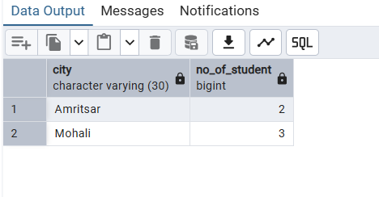
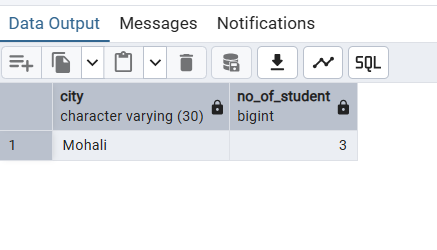

# Experiment 2: SQL GROUP BY, ORDER BY, and HAVING Clauses with Aggregation Functions

## 1. Aim of the Session

The purpose of this practical is to provide hands-on experience in using advanced SQL query techniques for data analysis and reporting. Students will learn how to group data, sort results, apply aggregate functions, and filter grouped data using the GROUP BY, ORDER BY, and HAVING clauses. This experiment focuses on generating meaningful reports from database records.

Purpose of the practical:
- To understand how to organize and summarize data using grouping
- To implement sorting and ordering of query results
- To filter aggregated data using HAVING clauses
- To generate reports and statistical analysis from database records

---

## 2. Objective of the Session

The specific goals of this session are:

- **Master GROUP BY Clause**: Learn to group records by one or more columns and organize data by categories
- **Implement Aggregation Functions**: Use COUNT, SUM, AVG, MIN, and MAX functions to calculate statistics
- **Apply ORDER BY Clause**: Sort query results in ascending or descending order
- **Use HAVING Clause**: Filter groups based on aggregate conditions
- **Generate Reports**: Create meaningful data analysis queries for business intelligence
- **Data Analysis**: Perform statistical analysis on student records

Upon completion, students will be able to:
- Write complex SQL queries with multiple clauses
- Create summary reports from raw data
- Apply aggregate functions to calculate statistics
- Filter and sort data for meaningful analysis
- Generate business intelligence reports

---

## 3. Practical / Experiment Steps

The experiment involves analyzing student data using advanced SQL techniques:

### Step 1: Create the Students Table
- Define a table to store student information
- Implement PRIMARY KEY constraint on id
- Use NUMERIC for numeric fields and VARCHAR for text fields

### Step 2: Insert Sample Student Data
- Insert 5 student records with ID, name, city, and marks
- Ensure data represents students from different cities
- Include varied marks for statistical analysis

### Step 3: Retrieve All Records
- Execute a basic SELECT query to view all student data
- Verify all records are correctly inserted

### Step 4: Apply GROUP BY with COUNT Aggregation
- Group students by city
- Count the number of students in each city
- Sort results by count in ascending order

### Step 5: Apply HAVING Clause
- Filter groups to show only cities with more than 2 students
- Combine GROUP BY with aggregate function filtering
- Display only meaningful groups based on conditions

---

## 4. Procedure of the Practical

Follow these sequential steps to execute the experiment:

### (i) Start the System and Open DBMS
- Power on the computer and log in
- Open the Database Management System (SQL Server / MySQL / Oracle)
- Ensure you have access to create and modify tables

### (ii) Create or Select the Required Database
- Create a new database or select an existing one
- Verify the database is active before proceeding

### (iii) Create the Students Table
```sql
CREATE TABLE Students (
    id NUMERIC(10,0) PRIMARY KEY,
    name VARCHAR(50),
    city VARCHAR(30),
    marks NUMERIC(10,0)
);
```
- Execute the command to create the table with proper data types
- Verify table structure and constraints

### (iv) Insert Student Records
```sql
INSERT INTO Students VALUES (1, 'Aman', 'Mohali', 85);
INSERT INTO Students VALUES (2, 'Rohit', 'Mohali', 78);
INSERT INTO Students VALUES (3, 'Neha', 'Mohali', 92);
INSERT INTO Students VALUES (4, 'Simran', 'Amritsar', 88);
INSERT INTO Students VALUES (5, 'Karan', 'Amritsar', 75);
```
- Execute all INSERT statements sequentially
- Verify each record is inserted successfully

### (v) Retrieve and Display All Records
```sql
SELECT * FROM students
```
- Execute the query to view all inserted records
- Verify the data appears correctly in the result set

### (vi) Apply GROUP BY with Aggregation and Sorting
```sql
SELECT CITY, COUNT(*) AS NO_OF_STUDENT
FROM Students
GROUP BY City
ORDER BY NO_OF_STUDENT ASC
```
- Execute the query to count students by city
- Observe how GROUP BY organizes data by city
- Note the ORDER BY sorts results by count in ascending order
- Results show each city with the number of students

### (vii) Apply HAVING Clause for Filtered Grouping
```sql
SELECT CITY, COUNT(*) AS NO_OF_STUDENT
FROM Students
GROUP BY City
HAVING COUNT(*) > 2
```
- Execute the query to filter groups
- HAVING clause filters groups where student count is greater than 2
- Only groups meeting the condition are displayed
- Compare with previous query to understand HAVING functionality

### (viii) Analyze and Document Results
- Note down the output of each query
- Understand the difference between WHERE and HAVING clauses
- Take screenshots of each successful execution
- Document observations about data grouping and aggregation

---

## 5. Input / Output Analysis

### Inputs Provided:

1. **Students Table Structure**: ID (Primary Key), Name, City, Marks
2. **Student Records**: 5 records with varied cities and marks
   - Mohali: 3 students (Aman: 85, Rohit: 78, Neha: 92)
   - Amritsar: 2 students (Simran: 88, Karan: 75)

### Expected Outputs:

1. **All Records Query**: Displays all 5 student records with complete information
2. **GROUP BY with ORDER BY**: Shows each city with student count, sorted by count
   - Expected result:
     - Amritsar: 2 students
     - Mohali: 3 students
3. **HAVING Filtered Query**: Shows only cities with more than 2 students
   - Expected result:
     - Mohali: 3 students

### Execution Screenshots:

**Figure 1: Students Table Creation and Initial Data**


**Figure 2: GROUP BY with COUNT and ORDER BY Results**


**Figure 3: HAVING Clause Filtered Results**


---

## 6. Learning Outcomes

### Concepts Understood:

- **GROUP BY Clause**: How to organize data into groups based on column values
- **Aggregate Functions**: Understanding COUNT, SUM, AVG, MIN, MAX and their applications
- **ORDER BY Clause**: How to sort query results in ascending/descending order
- **HAVING Clause**: Difference between WHERE (row filtering) and HAVING (group filtering)
- **Data Aggregation**: Computing statistics and summaries from raw data
- **SQL Query Optimization**: Writing efficient queries for data analysis

### Skills Developed:

- Ability to write GROUP BY queries with multiple clauses
- Capability to use aggregate functions for statistical analysis
- Understanding of sorting and filtering in SQL
- Proficiency in creating summary and analytical reports
- Skills in data manipulation and transformation
- SQL optimization for complex queries

### Practical Exposure Gained:

- Real-world data analysis scenarios using student records
- Practical experience with SQL reporting and business intelligence
- Understanding of how to generate meaningful statistics from raw data
- Hands-on experience with multi-clause SQL queries
- Knowledge of advanced query techniques for data summarization
- Practical data analysis and decision-making skills

### Key Takeaways:

Students will understand how to transform raw database records into meaningful reports and statistics. These skills are essential for data analysis, business intelligence reporting, and database-driven application development. The ability to write GROUP BY and HAVING queries is fundamental to extracting insights from data.

---

## 7. Common Use Cases

- **City-wise Student Analysis**: Count students per city for resource allocation
- **Academic Performance Reports**: Calculate average marks by city or class
- **Statistical Analysis**: Identify cities with significant student populations
- **Data Filtering**: Find cities with specific criteria (e.g., more than 2 students)
- **Business Intelligence**: Generate reports for academic decision-making

---

**Date Created**: January 21, 2026  
**Subject**: Database Management System (DBMS)  
**Experiment**: SQL GROUP BY, ORDER BY, and HAVING Clauses Analysis
