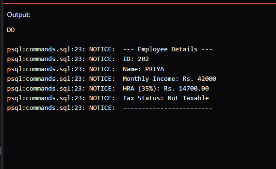

# Experiment 3

## Purpose
Explore the structure and execution of a PL/SQL block by writing a custom program with variable declarations, calculations, and conditional logic, then displaying results using output procedures.

---

## Key Goals
* Develop a PL/SQL script with both declaration and execution sections.
* Practice variable assignment, arithmetic, and conditional statements.

---

## Steps Performed
* Created a PL/SQL block with a declaration area for variables (ID, Name, Income).
* Assigned values to variables representing a sample employee.
* Calculated House Rent Allowance (HRA) as 35% of the income.
* Used IF-ELSE to determine tax status based on income threshold.
* Displayed all results using DBMS_OUTPUT.PUT_LINE.

---

## Procedure
1. Connected to the Oracle database.
2. Declared variables: `v_id`, `v_name`, `v_income`, and `v_hra`.
3. Set values: Name as 'PRIYA', Income as 42,000.
4. Computed HRA as 35% of income.
5. Used IF-ELSE to check if income is at least 50,000 for taxability.
6. Printed all details and results to the output console.
7. Ran and verified the script output.

---

## Input/Output Example

**Input:**
```sql
DECLARE
    v_id NUMBER := 202;
    v_name VARCHAR2(30) := 'PRIYA';
    v_income NUMBER := 42000;
    v_hra NUMBER;
BEGIN
    v_hra := v_income * 0.35;
    DBMS_OUTPUT.PUT_LINE('--- Employee Details ---');
    DBMS_OUTPUT.PUT_LINE('ID: ' || v_id);
    DBMS_OUTPUT.PUT_LINE('Name: ' || v_name);
    DBMS_OUTPUT.PUT_LINE('Monthly Income: Rs. ' || v_income);
    DBMS_OUTPUT.PUT_LINE('HRA (35%): Rs. ' || v_hra);
    IF v_income >= 50000 THEN
        DBMS_OUTPUT.PUT_LINE('Tax Status: Taxable');
    ELSE
        DBMS_OUTPUT.PUT_LINE('Tax Status: Not Taxable');
    END IF;
    DBMS_OUTPUT.PUT_LINE('------------------------');
END;
```

**Output:**



---

## What Was Learned
* How to structure and run a PL/SQL block with custom variables.
* Assigning and using different data types in PL/SQL.
* Applying conditional logic and calculations in procedural code.
* Using DBMS_OUTPUT to display formatted results.
